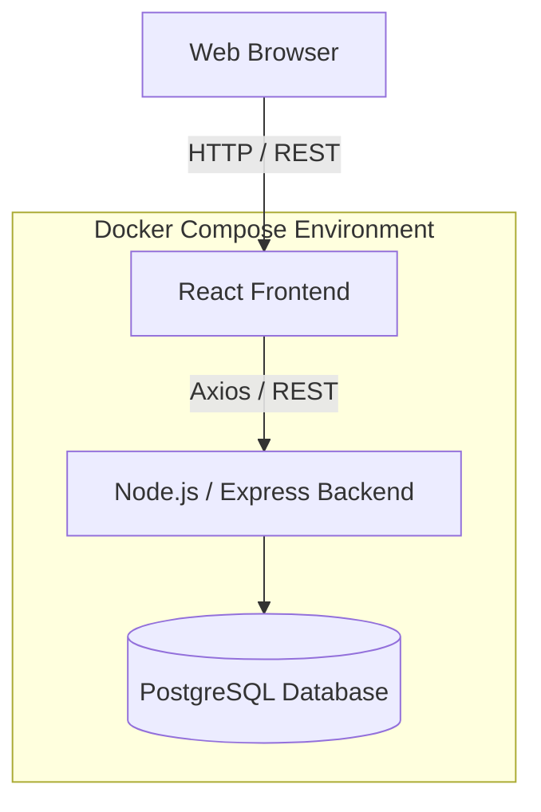

# StockFlow Architecture

StockFlow is designed as a modern, containerized, API-first SaaS application. It strictly enforces separation of concerns between the robust Node.js backend and the dynamic React frontend.

## High-Level Architecture

## Backend Architecture

The backend follows a domain-driven, layered architecture:

- **Controllers**: Handle HTTP requests, validate input via Zod, and return formatted responses.
- **Services**: Contain the core business logic and orchestrate operations.
- **Repositories**: Handle all data access logic via Prisma ORM.

### Key Technologies
- **Node.js + Express**: Core server framework.
- **Prisma ORM**: Type-safe database interactions.
- **Zod**: Runtime schema validation.
- **Pino**: High-performance structured logging.
- **Swagger**: Auto-generated API documentation.

## Frontend Architecture

The frontend is a Single Page Application (SPA) structured by business features:

- **Features (`/pages`)**: Distinct business domains (Inventory, Products, Sales, Purchases).
- **Hooks (`/lib/hooks`)**: Custom React Query hooks mapping to backend services.
- **Components (`/components`)**: Reusable UI primitives (shadcn/ui based).

### Key Technologies
- **React + Vite**: Fast UI rendering and dev server.
- **TanStack Query (React Query)**: Server state management and caching.
- **React Hook Form + Zod**: Client-side form validation matching backend rules.
- **Zustand**: Lightweight client state management (e.g., Auth).
- **Tailwind CSS + Radix UI**: Accessible, utility-first styling.

## Database Schema Highlights

- **Products**: Core item catalog.
- **Warehouses**: Storage locations.
- **InventoryBalances**: Tracks quantities of Products at specific Warehouses.
- **AuditLogs**: Immutable ledger of all system actions (Creation, Updates, Stock Movements).
- **Orders**: Purchase Orders (Inbound) and Sales Orders (Outbound) with lifecycle status tracking.

## CI/CD and Quality

- **Linting & Formatting**: ESLint and Prettier enforced across both workspaces.
- **Testing**: Vitest for fast, reliable unit and integration tests.
- **Containerization**: Multi-stage Dockerfiles ensure minimal image sizes and consistent deployments.
