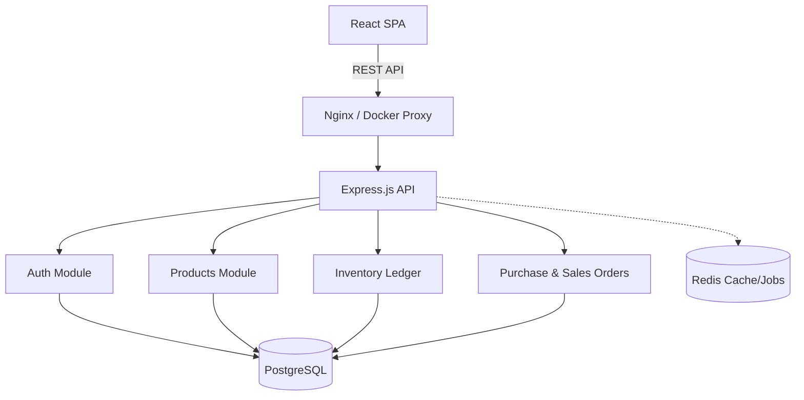

# StockFlow - Enterprise Inventory Management


StockFlow is a production-grade, multi-tenant inventory management and ERP backend, paired with a modern React dashboard. It is built with enterprise software engineering standards, focusing on a clean architecture, robust security, comprehensive audit trails, and strict data consistency through double-entry ledger patterns.

## Features

- **Multi-tenant Architecture**: Isolated data for different organizations.
- **Double-Entry Inventory Ledger**: Bulletproof stock tracking and historical accuracy.
- **Purchase & Sales Orders**: Complete lifecycle management from drafting to fulfillment.
- **Automated Reordering**: Low stock alerts and reporting.
- **Dashboard Analytics**: Real-time aggregation of revenue, stock value, and recent activity.
- **Robust Security**: Rate limiting, JWT auth, Helmet, CORS, parameterized queries.
- **Modern UI**: React, Vite, Zustand, TailwindCSS, and Recharts.

## Tech Stack

### Backend
- **Framework**: Node.js + Express + TypeScript
- **Database**: PostgreSQL (managed via Prisma ORM)
- **Caching & Jobs**: Redis (for background workers - planned)
- **Logging**: Pino (structured JSON logging)
- **Documentation**: Swagger UI
- **Testing**: Vitest + Supertest

### Frontend
- **Framework**: React 18 + Vite + TypeScript
- **Styling**: Tailwind CSS + `clsx` / `tailwind-merge`
- **State Management**: Zustand
- **Routing**: React Router v6
- **Data Fetching**: Axios
- **Visualization**: Recharts

### DevOps
- **Containerization**: Docker & Docker Compose
- **CI/CD**: GitHub Actions (Linting, Formatting, Type Checking, Testing, Coverage, Build)

## Quick Start (Docker)

The easiest way to run the entire stack is using Docker Compose.

```bash
# 1. Clone the repository
git clone https://github.com/yourusername/stockflow.git
cd stockflow

# 2. Start the stack
docker compose up --build
```

- **Frontend**: http://localhost:5173
- **Backend API**: http://localhost:3000/api/v1
- **Swagger Docs**: http://localhost:3000/api-docs

## Development Setup

If you prefer to run the services locally without Docker:

### 1. Database
Ensure PostgreSQL is running locally, or start it via docker compose:
```bash
docker compose up -d db redis
```

### 2. Backend
```bash
cd backend
npm install
# Setup env vars (copy from .env.example)
npx prisma migrate dev
npm run dev
```

### 3. Frontend
```bash
cd frontend
npm install
# Setup env vars
npm run dev
```

## Documentation

For deep dives into the system, refer to the following RC1 documents:
- [Architecture](ARCHITECTURE.md)
- [API Documentation](API.md)
- [Deployment Guide](DEPLOYMENT.md)
- [Internship Demo Script](INTERNSHIP_DEMO.md)
- [Production Readiness Report](PRODUCTION_READINESS_REPORT.md)

## Architecture

We employ a **Feature-First Clean Architecture**.



```text
src/
├── app.ts                 # Express app initialization
├── server.ts              # Entry point
├── common/                # Shared utilities (logger, error handling, middlewares)
├── modules/               # Feature modules
│   ├── auth/
│   ├── dashboard/
│   ├── inventory/
│   ├── products/
│   ├── purchase-orders/
│   └── sales-orders/
```

Each module isolates its Routes, Controllers, Services, and Repositories.

## Testing & Quality Gates

This project enforces strict quality checks:
- **Code Coverage Target**: 80%+
- **Test Runner**: Vitest

Run tests:
```bash
cd backend
npm run test -- --coverage
```

## Contributing
Please see `CONTRIBUTING.md` for guidelines.

## License
MIT License
