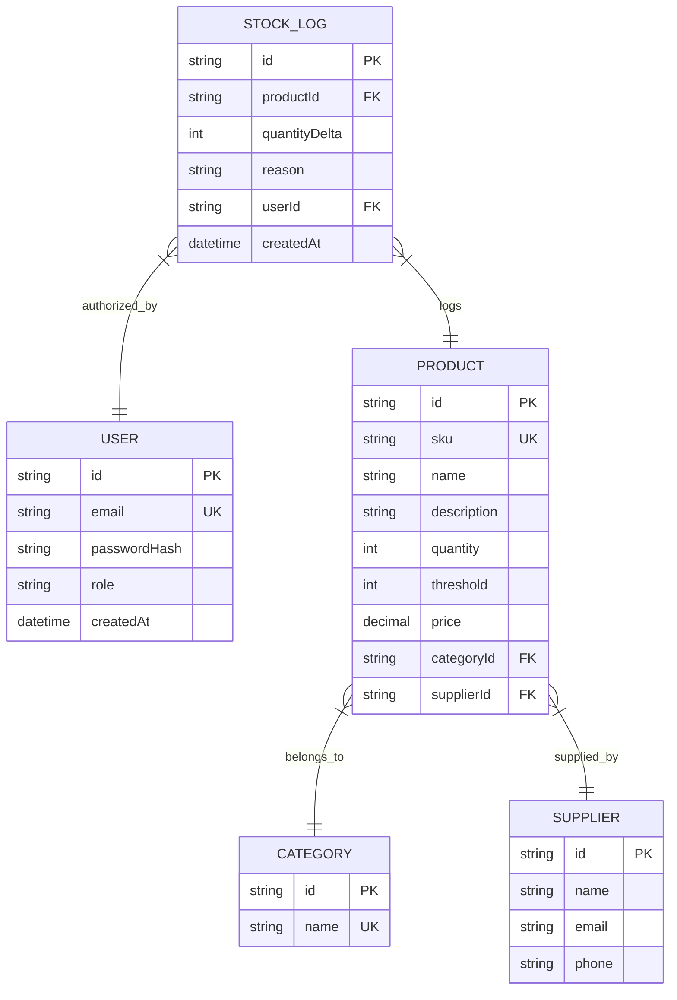

# StockFlow Database Architecture

We use **PostgreSQL** as our primary relational store, managed via **Prisma ORM**.

## Schema Entities

```mermaid
erDiagram
    USER {
        string id PK
        string email UK
        string passwordHash
        string role
        datetime createdAt
    }
    PRODUCT {
        string id PK
        string sku UK
        string name
        string description
        int quantity
        int threshold
        decimal price
        string categoryId FK
        string supplierId FK
    }
    CATEGORY {
        string id PK
        string name UK
    }
    SUPPLIER {
        string id PK
        string name
        string email
        string phone
    }
    STOCK_LOG {
        string id PK
        string productId FK
        int quantityDelta
        string reason
        string userId FK
        datetime createdAt
    }

    PRODUCT }|--|| CATEGORY : belongs_to
    PRODUCT }|--|| SUPPLIER : supplied_by
    STOCK_LOG }|--|| PRODUCT : logs
    STOCK_LOG }|--|| USER : authorized_by
```
